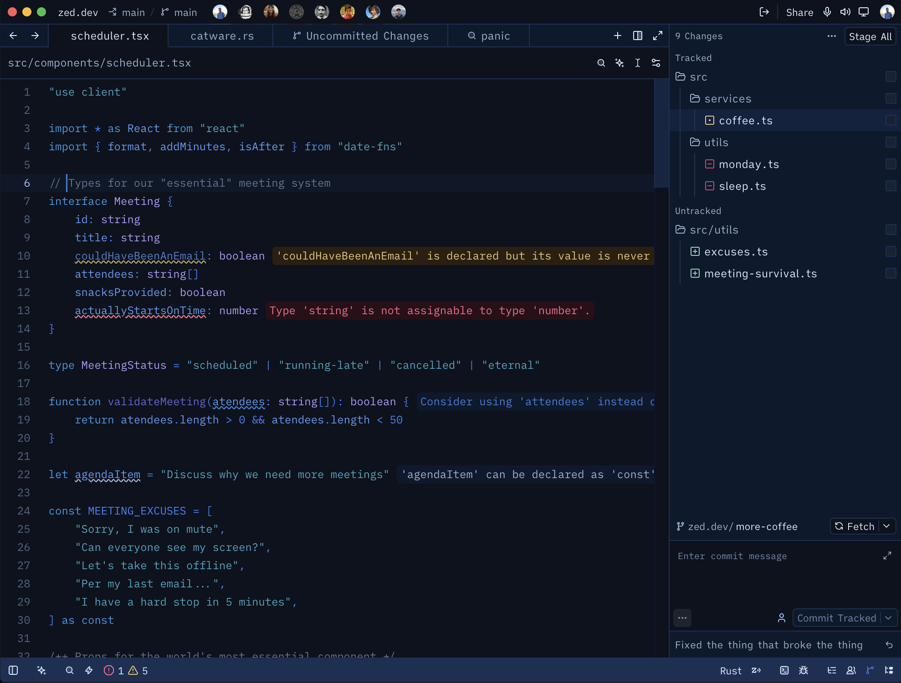
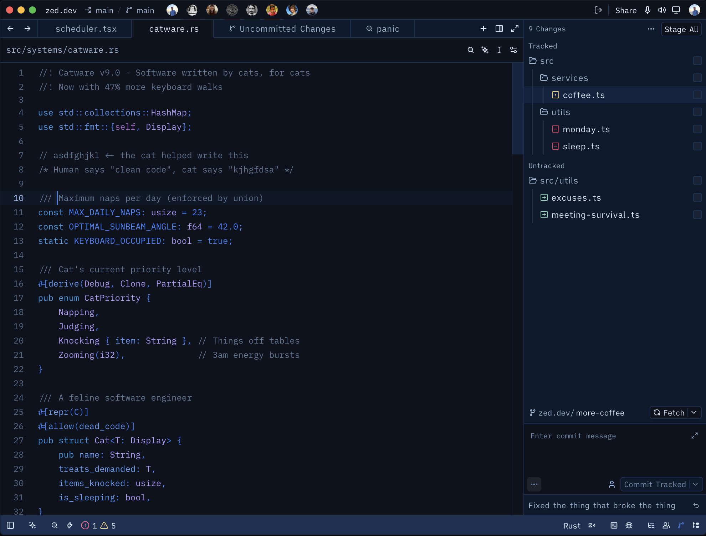
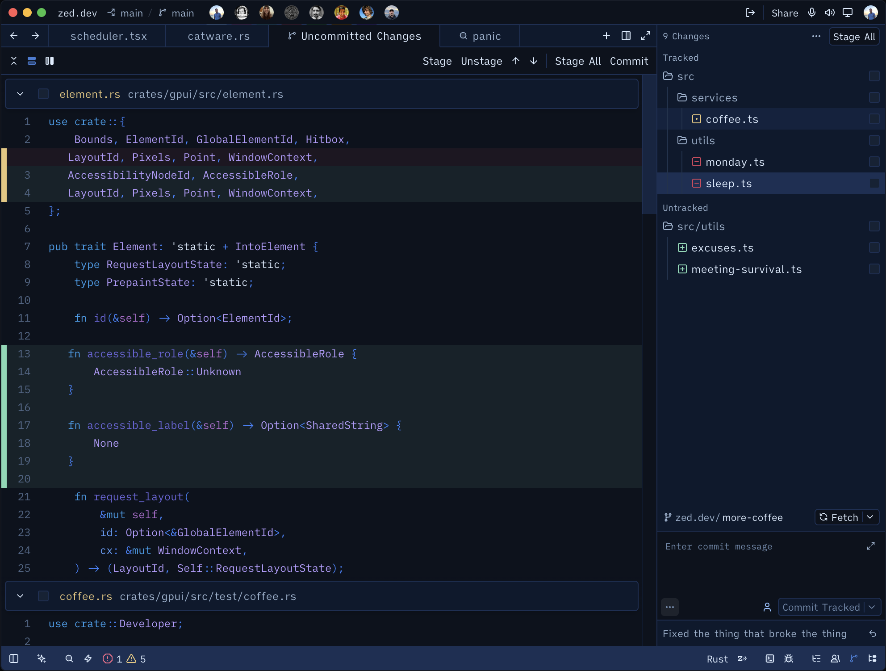
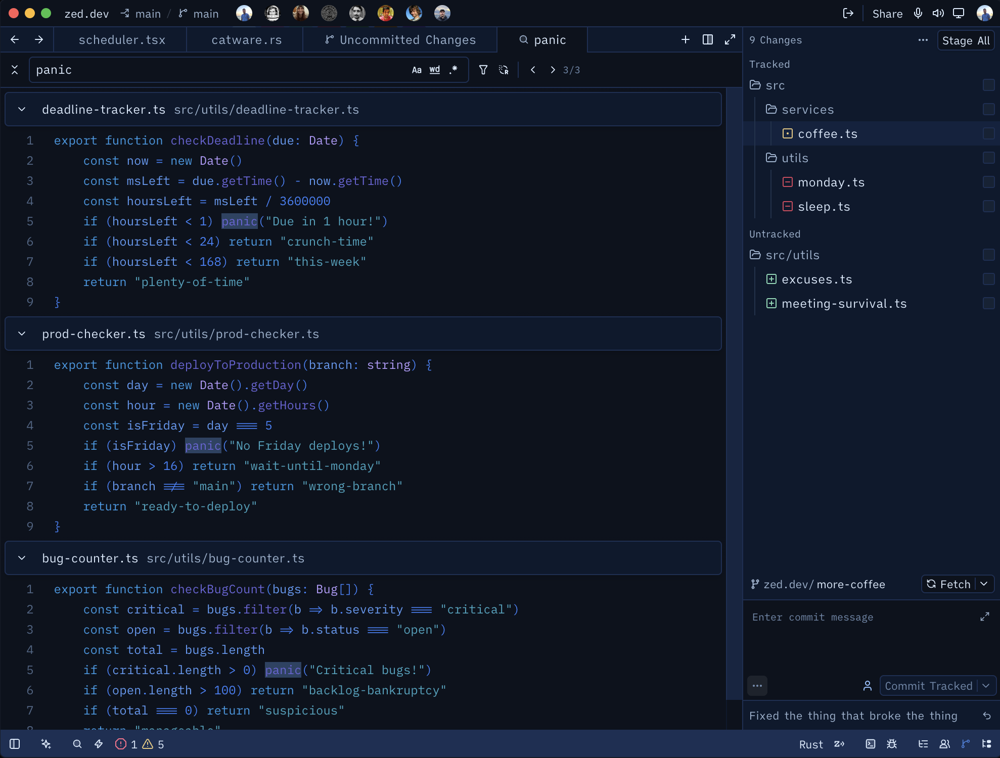

  

<h1 align="center">Blueberry Night</h1>

A deep blue night theme with blueberry tones for Zed editor.

## Screenshots

## Installation

1. Open Zed
2. Go to Extensions (`cmd + shift + x`)
3. Search for **Blueberry Night**
4. Click Install

## Color Palette

| Usage | Color |
|-------|-------|
| Background | `#0c121d` |
| Variables | `#5a9dfa` |
| Strings | `#38a6c2` |
| Functions | `#6965da` |
| Keywords | `#289ce9` |
| Control flow | `#af6acd` |
| Types | `#b59cff` |
| Comments | `#5f7694` |

## Author

Made by [rangaNP](https://github.com/rangaNP)